---
# DIAGNOAI - MEDICAL RAG ASSISTANT
[](https://github.com/bhupencoD3/DiagnoAI/stargazers) [](https://github.com/bhupencoD3/DiagnoAI/issues) [](https://opensource.org/licenses/Apache-2.0) [](https://github.com/bhupencoD3/DiagnoAI/releases/tag/v1.0)

## Table of Contents
- [Important Medical Disclaimer](#important-medical-disclaimer)
- [Project Overview](#project-overview)
- [Architecture](#architecture)
- [Datasets and Attribution](#datasets-and-attribution)
- [Model Selection and Performance](#model-selection-and-performance)
- [Technical Implementation](#technical-implementation)
- [Deployment Architecture](#deployment-architecture)
- [Installation and Setup](#installation-and-setup)
- [API Endpoints](#api-endpoints)
- [Project Structure](#project-structure)
- [Usage Examples and Patterns](#usage-examples-and-patterns)
- [Limitations and Ethical Considerations](#limitations-and-ethical-considerations)
- [Research and Educational Value](#research-and-educational-value)
- [License](#license)
- [Contributing and Development](#contributing-and-development)
- [Areas for Improvement](#areas-for-improvement)
- [Support and Contact](#support-and-contact)

## LIVE DEMO
Access the application at: [http://34.172.189.153:30966](http://34.172.189.153:30966)

## IMPORTANT MEDICAL DISCLAIMER
### WARNING: FOR EDUCATIONAL AND LEARNING PURPOSES ONLY
This application is strictly a demonstration of how Retrieval-Augmented Generation (RAG) systems can be implemented in the medical domain. It is **NOT** intended for actual medical diagnosis, treatment, or clinical decision-making.  
The AI model can and will make incorrect predictions and provide inaccurate medical information. It should never be used as a substitute for professional medical advice from licensed healthcare providers.  
**NEVER** use this system for real medical decisions. Always consult qualified healthcare professionals for medical concerns.  
This project demonstrates technical implementation concepts only and is not medically validated.

## PROJECT OVERVIEW
DiagnoAI is a medical question-answering system that combines Retrieval-Augmented Generation (RAG) with multiple medical knowledge sources to provide responses to health-related queries. Keywords: RAG, medical AI, LLM, Kubernetes.

### Key Features
- Multi-source medical knowledge integration
- Real-time medical terminology lookup
- Hybrid retrieval with medical domain optimization
- Kubernetes deployment with Docker support
- Health monitoring and logging
- Screenshot documentation for UI/UX demos

## ARCHITECTURE
### CORE COMPONENTS
| Component | Technology | Purpose |
|-----------|------------|---------|
| Frontend | HTML/JS ([static/index.html](static/index.html)) | User interface with medical term highlighting and responsive design |
| Backend API | FastAPI with Python 3.11 ([app/main.py](app/main.py)) | REST API with query processing and route handling |
| Vector Store | ChromaDB with OpenAI embeddings (data/vector_store/) | Document retrieval and similarity search |
| LLM Service | Grok API (Llama 3.3 70B) or local Ollama | Answer generation with structured formatting |
| Orchestration | Kubernetes with k3s or Docker Compose | Container orchestration, scaling, and local development |
| Data Sources | MedlinePlus, Medical Meadow, FDA Drugs | Medical knowledge base with processed datasets |
| Configuration | Pydantic-based ([utils/config.py](utils/config.py)) | Environment-specific settings for dev/prod |

### SYSTEM ARCHITECTURE

```mermaid
graph TB
    %% Frontend Layer
    subgraph "Frontend Layer"
        A[Web Interface<br/><b>static/index.html</b>]
        A --> B[Medical Term Highlighter<br/><b>Real-time Processing</b>]
    end

    %% API Gateway Layer
    subgraph "API Gateway Layer"
        C[FastAPI Gateway<br/><b>app/main.py</b>]
        C --> D[Request Router<br/><b>Endpoint Management</b>]
        D --> E[Authentication<br/><b>Rate Limiting</b>]
        D --> F[Request Validation<br/><b>Pydantic Schemas</b>]
    end

    %% Core Service Layer
    subgraph "Core Service Layer"
        G[RAG Engine<br/><b>src/rag/</b>]
        H[LLM Orchestrator<br/><b>src/llm/</b>]
        I[Medical Dictionary<br/><b>data/medical_dictionary.py</b>]
        
        G --> J[Vector Store<br/><b>ChromaDB</b>]
        G --> K[Embedding Service<br/><b>OpenAI/Local</b>]
        H --> L[Grok API Client<br/><b>Llama 3.3 70B</b>]
        H --> M[Ollama Fallback<br/><b>Local Models</b>]
    end

    %% Data Processing Layer
    subgraph "Data Processing Layer"
        N[Data Ingestion Pipeline<br/><b>scripts/</b>]
        O[Medical Knowledge Base<br/><b>data/processed/</b>]
        P[Quality Metrics<br/><b>data/processed/metrics/</b>]
        
        N --> Q[MedlinePlus Processor<br/><b>1,022 chunks</b>]
        N --> R[Medical Meadow Processor<br/><b>11,613 Q&A</b>]
        N --> S[FDA Drugs Processor<br/><b>Drug Safety</b>]
    end

    %% Infrastructure Layer
    subgraph "Infrastructure Layer"
        T[Kubernetes Cluster<br/><b>k3s</b>]
        U[Docker Containerization<br/><b>Container Runtime</b>]
        V[Persistent Storage<br/><b>PVCs</b>]
        W[Monitoring & Logging<br/><b>src/utils/logger.py</b>]
    end

    %% External Services
    subgraph "External Services"
        X[Grok API<br/><b>api.groq.com</b>]
        Y[MedlinePlus API<br/><b>medlineplus.gov</b>]
        Z[Wikipedia API<br/><b>en.wikipedia.org</b>]
    end

    %% Data Flow
    A --> C
    C --> G
    C --> H
    G --> J
    G --> K
    H --> X
    H --> M
    N --> O
    O --> J
    W -.-> C
    W -.-> G
    W -.-> H
    I -.-> A
    I -.-> G
    
    %% Styling with better contrast
    classDef frontend fill:#e1f5fe,stroke:#01579b,stroke-width:2px,color:#000000
    classDef api fill:#f3e5f5,stroke:#4a148c,stroke-width:2px,color:#000000
    classDef core fill:#e8f5e8,stroke:#1b5e20,stroke-width:2px,color:#000000
    classDef data fill:#fff3e0,stroke:#e65100,stroke-width:2px,color:#000000
    classDef infra fill:#fce4ec,stroke:#880e4f,stroke-width:2px,color:#000000
    classDef external fill:#ffebee,stroke:#b71c1c,stroke-width:2px,color:#000000
    
    class A,B frontend
    class C,D,E,F api
    class G,H,I,J,K,L,M core
    class N,O,P,Q,R,S data
    class T,U,V,W infra
    class X,Y,Z external
```



## DATASETS AND ATTRIBUTION
### Dataset Summary
| Dataset | Source | Chunks/Size | Focus | Citation |
|---------|--------|-------------|-------|----------|
| MedlinePlus | [U.S. National Library of Medicine (NLM)](https://medlineplus.gov/) | 1,022 chunks (~363 words avg) | Diseases & wellness | [](https://www.nlm.nih.gov/) (Public Domain; [License](https://www.nlm.nih.gov/about/policies.html))<br>Shoutout: Thanks to NLM for authoritative, free medical topics! Processed from [data/raw/mplus_topics_2025-10-01.xml](data/raw/mplus_topics_2025-10-01.xml). |
| Medical Meadow QA | [WikiDoc Medical Encyclopedia](https://www.wikidoc.org/) via [MedAlpaca/Medical Meadow](https://huggingface.co/datasets/MedAlpaca/MedicalMeadow) | 11,613 Q&A chunks (65.6% avg quality) | Structured Q&A | [](https://huggingface.co/datasets/MedAlpaca/MedicalMeadow) (CC-BY-SA 4.0; [License](https://creativecommons.org/licenses/by-sa/4.0/))<br>Shoutout: Kudos to Han et al. (2023) for this high-quality medical QA dataset—powers our intent-based routing! From [data/raw/medical_meadow_wikidoc.json](data/raw/medical_meadow_wikidoc.json). |
| OpenFDA Drugs | [U.S. Food and Drug Administration (FDA)](https://open.fda.gov/) | N/A (labeling data) | Drug safety & interactions | [](https://open.fda.gov/) (Public Domain; [License](https://open.fda.gov/terms/))<br>Shoutout: Grateful to FDA for open drug labels—enables safety checks! Processed via [data/raw/openfda_drug_labels.jsonl](data/raw/openfda_drug_labels.jsonl). |

#### MedlinePlus
Source: U.S. National Library of Medicine
- 1,017 medical topics processed into 1,022 chunks (from [data/raw/mplus_topics_2025-10-01.xml](data/raw/mplus_topics_2025-10-01.xml))
- Authoritative information on diseases, conditions, and wellness
- Context-preserving chunking with optimal information retention
- Average chunk size: 362.7 words
- Processed output: data/processed/medline_plus_chunks/

#### Medical Meadow QA
Source: WikiDoc Medical Encyclopedia
- 11,613 high-quality Q&A chunks with quality scoring (from [data/raw/medical_meadow_wikidoc.json](data/raw/medical_meadow_wikidoc.json))
- Structured medical question-answer format
- Quality distribution: 65.6% average quality score
- 45.3% excellent, 27.1% good, 20.2% fair, 13.7% poor quality chunks
- Processed output: data/processed/meadow_chunks/
- Metrics: Generated via [scripts/generate_meadow_metrics.py](scripts/generate_meadow_metrics.py) (view raw: [meadow_metrics.json](data/processed/meadow_chunks/meadow_metrics.json))

#### OpenFDA Drug Information
Source: U.S. Food and Drug Administration
- FDA-approved drug labeling and safety information (from [data/raw/openfda_drug_labels.jsonl](data/raw/openfda_drug_labels.jsonl))
- Medication indications, contraindications, and interactions
- Drug safety profiles and usage guidelines
- Processed output: data/processed/openfda/

### Data Processing Pipeline
All datasets underwent medical-domain optimization:
1. Context-Preserving Chunking - Medical content maintained in meaningful segments ([src/data_processing/medlineplus_chunker.py](src/data_processing/medlineplus_chunker.py), [text_cleaner.py](src/data_processing/text_cleaner.py))
2. Quality Scoring - Automated quality assessment for retrieval prioritization
3. Metadata Enrichment - Medical concepts, synonyms, and categorization
4. Cross-Dataset Integration - Unified knowledge base with source tracking ([data/processed/medical_knowledge_base_v2.json](data/processed/medical_knowledge_base_v2.json))
5. XML/JSON Parsing - Custom parsers for raw data ([src/data_processing/xml_parser.py](src/data_processing/xml_parser.py))

### Dataset Metrics
#### Medical Meadow QA Metrics
From [data/processed/metrics/meadow_metrics.json](data/processed/meadow_chunks/meadow_metrics.json):
- Total chunks: 11,613
- Average tokens: 159.61
- Quality analysis: Excellent (80-100): 4,531; Good (60-79): 3,146; Fair (40-59): 2,343; Poor (0-39): 1,593
- Average quality: 65.56

#### MedlinePlus Metrics
From [data/processed/medline_plus_chunks/medlineplus_chunking_metrics.json](data/processed/medline_plus_chunks/medlineplus_chunking_metrics.json):
- Total topics: 1,017
- Total chunks: 1,022
- Average chunk size: 362.7 words
- Total words: 370,680
- Size distribution: 6.0% small (<100 words), 56.8% medium (100-300 words), 37.2% large (>=300 words)

This project leverages open datasets—see [CREDITS.md](CREDITS.md) for full acknowledgments and update logs.

## MODEL SELECTION AND PERFORMANCE
### Local Model Experimentation
Extensive testing was conducted with local models to determine optimal medical reasoning capabilities:
| Model | Performance | Requirements | Medical Accuracy | Trade-offs |
|-------|-------------|--------------|------------------|------------|
| Biomistral 7B | Best | GPU Recommended | Excellent | Local privacy; no API costs |
| Mistral 7B | Good | GPU Required | Strong | Balanced speed/accuracy |
| Llama 3.1 8B | Good | High RAM | Competitive | Resource-heavy; slower inference |

Biomistral 7B demonstrated superior medical reasoning and accuracy for local deployment scenarios.

### Deployment Constraints
Due to cloud deployment limitations and lack of GPU resources, the system uses Grok API (Llama 3.3 70B Versatile):
- High-throughput API access without GPU requirements
- Consistent performance and reliability
- Excellent medical reasoning capabilities
- Cost-effective scaling for demonstration purposes

Local fallback: Ollama integration via [src/llm/ollama_client.py](src/llm/ollama_client.py) for GPU-enabled environments.

**RECOMMENDATION**: If GPU access is available, deploy Biomistral 7B locally for optimal accuracy, data privacy, and medical domain performance.

## TECHNICAL IMPLEMENTATION
### RAG Implementation Details
#### Hybrid Search Strategy
- Semantic Search with medical domain optimization ([src/rag/retriever.py](src/rag/retriever.py))
- Source-Aware Boosting: MedlinePlus (1.5x), FDA Drugs (1.3x), Medical Meadow (1.0x)
- Intent-Based Query Routing with medical concept detection
- Strict Relevance Filtering with quality thresholds

#### Medical-Specific Retrieval Features
- Symptom analysis and pattern recognition
- Treatment and medication inquiry handling
- Cause and risk factor identification
- Diagnosis and testing information routing
- Prevention and lifestyle guidance optimization

#### Vector Store Configuration
- ChromaDB with persistent medical metadata storage (data/vector_store/chroma.sqlite3)
- OpenAI Embeddings (text-embedding-3-small, 1536D) with local fallback ([src/rag/embeddings.py](src/rag/embeddings.py), models/embeddings/)
- Collection Optimization for medical terminology and concepts
- Hybrid Search with configurable alpha parameter (default: 0.7)

### API Design and Reliability
#### FastAPI Backend Features
- Comprehensive health monitoring with readiness probes (app/routes/)
- Request cancellation support for long-running queries
- Graceful degradation when services are unavailable
- Medical term definition lookup with external fallbacks
- Real-time performance metrics and monitoring ([src/utils/logger.py](src/utils/logger.py))
- Pydantic models for request/response validation ([src/api/models.py](src/api/models.py))

#### Medical Terminology Processing
- 150+ medical terms with detailed definitions and severity categorization ([data/medical_dictionary.py](data/medical_dictionary.py))
- Severity Levels: Emergency, Serious, Moderate, Mild, Information
- External Integration: MedlinePlus and Wikipedia fallbacks
- Visual Categorization: Color-coded term highlighting in UI (screenshots/ for demos)

### Medical Dictionary
See [data/medical_dictionary.py](data/medical_dictionary.py) for the full dictionary, including terms like hypertension (cardiovascular, serious) and category colors.

## DEPLOYMENT ARCHITECTURE
### Kubernetes Deployment Specifications
#### Cluster Configuration
- k3s lightweight Kubernetes cluster
- Persistent Volume Claims for vector store and data persistence ([deployment/k8s/data-pvc.yaml](deployment/k8s/data-pvc.yaml), [vector-store-pvc.yaml](deployment/k8s/vector-store-pvc.yaml))
- ConfigMap for application configuration management ([deployment/k8s/configmap.yaml](deployment/k8s/configmap.yaml))
- Secrets for secure API key storage

#### Resource Requirements
See [deployment/k8s/deployment.yaml](deployment/k8s/deployment.yaml) for full resource specs.

#### Health Monitoring
- Startup Probe: 30 retries, 10-second intervals
- Liveness Probe: /health endpoint, 60-second initial delay
- Readiness Probe: /ready endpoint, 30-second initial delay

### Docker Compose for Local Development
New: Use [docker-compose.yml](docker-compose.yml) for quick local setup with services (FastAPI, ChromaDB).

### Deployment Scripts
#### Cluster Management Scripts
- [deployment/scripts/start-cluster.sh](deployment/scripts/start-cluster.sh) — Initialize and start the cluster
- [deployment/scripts/stop-cluster.sh](deployment/scripts/stop-cluster.sh) — Stop cluster while preserving data
- [deployment/scripts/status.sh](deployment/scripts/status.sh) — Check cluster and application status
- [deployment/scripts/deploy.sh](deployment/scripts/deploy.sh) — Full deployment pipeline execution

#### Example: deployment/scripts/deploy.sh
See [deployment/scripts/deploy.sh](deployment/scripts/deploy.sh) for the full script.

#### Kubernetes Manifests
- [configmap.yaml](deployment/k8s/configmap.yaml)
- [deployment.yaml](deployment/k8s/deployment.yaml)
- [namespace.yaml](deployment/k8s/namespace.yaml)
- [service.yaml](deployment/k8s/service.yaml)
- [vector-store-pvc.yaml](deployment/k8s/vector-store-pvc.yaml)
- [data-pvc.yaml](deployment/k8s/data-pvc.yaml)

#### Dockerfile
See [Dockerfile](Dockerfile) for the full container build instructions.

#### requirements.txt
See [requirements.txt](requirements.txt) for the full dependency list. Key deps: fastapi, chromadb, openai, pydantic.

## INSTALLATION AND SETUP
### Local Development Setup
#### 1. Clone and Environment Setup
```
git clone https://github.com/bhupencoD3/DiagnoAI.git
cd DiagnoAI
python -m venv venv
source venv/bin/activate # Windows: venv\Scripts\activate
pip install -r requirements.txt
```

#### 2. Environment Configuration
Create config files based on [config.py](utils/config.py):
```
# Use config/development.py for local dev
export PYTHONPATH="${PYTHONPATH}:$(pwd)"
# Edit config/settings.py or use .env for API keys if integrated
# OPENAI_API_KEY=your_openai_key
# GROK_API_KEY=your_grok_key
# HF_TOKEN=your_huggingface_token
# REPLICATE_API_TOKEN=your_replicate_token
```

#### 3. Data Processing and Initialization
```
# Process medical datasets
python scripts/process_medical_meadow.py
python scripts/generate_meadow_metrics.py # Generate quality metrics
python scripts/ingest_medical_knowledge.py # Load unified KB
# Initialize vector store
python scripts/setup_vector_db.py
python scripts/run_ingestion.py # Alternative batch ingestion
```

#### 4. Start Development Server
```
python app/main.py
# Application available at: http://localhost:8000
# Or use scripts/start_services.sh for multi-service startup
```

### Docker Compose Setup
#### Quick Local Deployment
```
docker-compose up -d
# Access at: http://localhost:8000
# Logs: docker-compose logs -f
# Data persistence: Volumes for data/ and vector_store/
```

### Kubernetes Deployment
#### 1. Cluster Initialization
```
# Make scripts executable
chmod +x deployment/scripts/*.sh
# Start cluster and deploy application
./deployment/scripts/start-cluster.sh
```

#### 2. Deployment Verification
```
# Check deployment status
./deployment/scripts/status.sh
# Verify application health
curl http://localhost:8000/health
```

#### 3. Access Points
- Web Interface: http://<node-ip>:30080 or http://34.172.189.153:30966
- API Documentation: http://<node-ip>:30080/docs
- Health Dashboard: http://<node-ip>:30080/health

### Deployment Steps with Python Files
For those interested in the Python-based deployment flow:
1. **Data Ingestion**: Run [scripts/ingest_medical_knowledge.py](scripts/ingest_medical_knowledge.py) or [scripts/run_ingestion.py](scripts/run_ingestion.py) to load chunks from [data/processed/medical_knowledge_base_v2.json](data/processed/medical_knowledge_base_v2.json) into ChromaDB. This script handles batching and error recovery.
2. **Meadow QA Processing**: Execute [scripts/process_medical_meadow.py](scripts/process_medical_meadow.py) to process raw JSON from [data/raw/medical_meadow_wikidoc.json](data/raw/medical_meadow_wikidoc.json) into chunks in [data/processed/meadow_chunks/](data/processed/meadow_chunks/).
3. **Vector DB Setup**: Use [scripts/setup_vector_db.py](scripts/setup_vector_db.py) to validate settings, load chunks from data/processed/, generate embeddings, and test retrieval.
4. **Main Application**: The entry point is [app/main.py](app/main.py), which initializes FastAPI, loads the medical dictionary from [data/medical_dictionary.py](data/medical_dictionary.py), sets up RAG components, and handles endpoints via [src/api/routes.py](src/api/routes.py).
5. **Frontend**: Static HTML at [static/index.html](static/index.html) with JS for interactions, medical term highlighting, and API calls. Responsive screenshots in screenshots/.
6. **LLM Integration**: [src/llm/grok_client.py](src/llm/grok_client.py) manages Grok API calls with prompt templating from [src/llm/prompts.py](src/llm/prompts.py). Local Ollama support in [src/llm/ollama_client.py](src/llm/ollama_client.py).
7. **RAG Components**: Embeddings in [src/rag/embeddings.py](src/rag/embeddings.py), retrieval in [src/rag/retriever.py](src/rag/retriever.py), vector store in [src/rag/vector_store.py](src/rag/vector_store.py).
8. **Data Processing**: Custom modules in src/data_processing/ for chunking, cleaning, and parsing.
9. **Utils**: Configuration in [src/utils/config.py](src/utils/config.py) with validation; logging in [src/utils/logger.py](src/utils/logger.py).
10. **Docs**: API details in [docs/api_documentation.md](docs/api_documentation.md); schema in [docs/data_schema.md](docs/data_schema.md).

For Kubernetes, apply manifests as shown above, then use scripts for cluster management. Logs are in logs/ (api.log, ingestion.log).

## API ENDPOINTS
### Core Medical Endpoints
#### POST /query
Main medical query processing endpoint  
**Request:**
```json
{
  "query": "What are the symptoms and treatment for diabetes?",
  "n_results": 5,
  "temperature": 0.1,
  "max_tokens": 1000,
  "request_id": "optional_request_id"
}
```
**Response:**
```json
{
  "answer": "Structured medical response...",
  "sources": ["Source documents with metadata"],
  "retrieval_metrics": {"relevance_score": 0.85, "sources_used": 3},
  "processing_time": 2.45,
  "request_id": "request_identifier"
}
```
Details: [docs/api_documentation.md](docs/api_documentation.md)

#### POST /medical-term
Medical terminology lookup service  
**Request:**
```json
{
  "term": "hypertension"
}
```
**Response:**
```json
{
  "term": "hypertension",
  "definition": "Detailed medical definition...",
  "category": "cardiovascular",
  "severity": "serious",
  "source": "DiagnoAI Medical Dictionary",
  "found": true
}
```

### Monitoring and Health Endpoints
- GET /health: Comprehensive system health check
- GET /healthz: Liveness probe
- GET /ready: Readiness probe
- GET /service-status: Detailed service status
- GET /dictionary-stats: Medical dictionary statistics

Interactive API docs: http://localhost:8000/docs (local) or http://<node-ip>:30080/docs (deployed). See [docs/api_documentation.md](docs/api_documentation.md) for full schema.

## PROJECT STRUCTURE
```
Directory structure:
└── bhupencod3-diagnoai/
    ├── README.md
    ├── docker-compose.yml
    ├── Dockerfile
    ├── LICENSE
    ├── requirements.txt
    ├── .dockerignore
    ├── app/
    │   ├── __init__.py
    │   ├── main.py
    │   ├── db/
    │   │   └── __init__.py
    │   ├── models/
    │   │   └── __init__.py
    │   ├── routes/
    │   │   └── __init__.py
    │   ├── services/
    │   │   └── __init__.py
    │   ├── tests/
    │   │   └── __init__.py
    │   └── utils/
    │       └── __init__.py
    ├── config/
    │   ├── __init__.py
    │   ├── development.py
    │   ├── production.py
    │   └── settings.py
    ├── data/
    │   ├── __init__.py
    │   ├── medical_dictionary.py
    │   └── processed/
    │       ├── meadow_chunks/
    │       │   ├── meadow_metrics.json
    │       │   └── meadow_pipeline_analysis.json
    │       └── medline_plus_chunks/
    │           └── medlineplus_chunking_metrics.json
    ├── deployment/
    │   ├── k8s/
    │   │   ├── configmap.yaml
    │   │   ├── data-pvc.yaml
    │   │   ├── deployment.yaml
    │   │   ├── namespace.yaml
    │   │   ├── service.yaml
    │   │   └── vector-store-pvc.yaml
    │   └── scripts/
    │       ├── deploy.sh
    │       ├── start-cluster.sh
    │       ├── status.sh
    │       └── stop-cluster.sh
    ├── docs/
    │   ├── api_documentation.md
    │   └── data_schema.md
    ├── scripts/
    │   ├── generate_meadow_metrics.py
    │   ├── ingest_medical_knowledge.py
    │   ├── process_medical_meadow.py
    │   ├── run_ingestion.py
    │   ├── setup_vector_db.py
    │   ├── start-prod.sh
    │   └── start_services.sh
    ├── src/
    │   ├── api/
    │   │   ├── __init__.py
    │   │   ├── models.py
    │   │   └── routes.py
    │   ├── data_processing/
    │   │   ├── __init__.py
    │   │   ├── medlineplus_chunker.py
    │   │   ├── text_cleaner.py
    │   │   ├── xml_parser.py
    │   │   ├── meadow/
    │   │   │   ├── __init__.py
    │   │   │   ├── meadow_chunker.py
    │   │   │   ├── meadow_cleaner.py
    │   │   │   ├── meadow_parser.py
    │   │   │   └── meadow_pipeline.py
    │   │   └── openfda/
    │   │       └── openfda_drug_chunking.py
    │   ├── llm/
    │   │   ├── __init__.py
    │   │   ├── grok_client.py
    │   │   ├── ollama_client.py
    │   │   └── prompts.py
    │   ├── rag/
    │   │   ├── __init__.py
    │   │   ├── embeddings.py
    │   │   ├── retriever.py
    │   │   └── vector_store.py
    │   └── utils/
    │       ├── __init__.py
    │       ├── config.py
    │       ├── exception.py
    │       └── logger.py
    ├── static/
    │   └── index.html
    └── .github/
        └── workflows/
            ├── deploy.yml
            └── start-stop.yml
```

## USAGE EXAMPLES AND PATTERNS
### Medical Query Categories
#### Symptom Analysis
- "What are the common symptoms of diabetes?"
- "How to recognize early signs of stroke?"
- "What symptoms indicate a medical emergency?"

#### Treatment Inquiries
- "What medications are used for hypertension?"
- "Non-drug treatments for anxiety disorders"
- "Side effects of common antibiotics"

#### Condition Information
- "What causes migraines and how to prevent them?"
- "Risk factors for heart disease in young adults"
- "Long-term management of arthritis"

#### Medication Safety
- "Drug interactions between ibuprofen and blood pressure medication"
- "Safe dosage limits for over-the-counter pain relievers"
- "Alcohol consumption with prescription medications"

### Developer Integration Patterns
#### Basic Medical Query Processing
See [src/rag/retriever.py](src/rag/retriever.py) and [src/llm/grok_client.py](src/llm/grok_client.py) for implementation details. Tests in app/tests/.

#### Medical Term Lookup Integration
See [app/main.py](app/main.py) and [src/api/routes.py](src/api/routes.py) for the endpoint handling in FastAPI.

UI Demos: Responsive screenshots in screenshots/medical-ai-interface/ (desktop/mobile views).

## LIMITATIONS AND ETHICAL CONSIDERATIONS
### Technical Limitations
#### Model Constraints
- External API Dependency: Relies on Grok API availability
- Potential Hallucinations: LLMs can generate incorrect medical information
- Knowledge Cutoff: Limited to training data timeframe
- No Personal Context: Cannot consider individual health history

#### Domain-Specific Limitations
- Not Diagnostic: Cannot provide medical diagnoses
- Emergency Limitations: Not suitable for urgent medical situations
- Coverage Gaps: Limited to knowledge base scope
- Regulatory Compliance: Not medically validated

### Ethical Implementation Requirements
#### Mandatory Safeguards
- Clear medical disclaimers on all interfaces
- No personal health information storage
- Transparency about AI limitations
- Regular accuracy validation protocols (via app/tests/)

#### Prohibited Use Cases
- Actual medical diagnosis or treatment decisions
- Emergency medical guidance or triage
- Replacement for healthcare professional consultation
- Processing of identifiable health information

## RESEARCH AND EDUCATIONAL VALUE
This project serves as an example of:
- RAG Implementation for specialized domains
- Medical Information Retrieval techniques and optimization
- Multi-Source Knowledge Integration strategies
- Scalable AI Application deployment patterns (Kubernetes + Docker)
- Ethical AI in sensitive domains with logging and monitoring

### Learning Opportunities
- Medical domain adaptation of NLP systems
- Hybrid search strategies for specialized content
- API design for AI-powered applications (Pydantic + FastAPI)
- Container orchestration for machine learning systems
- Data processing pipelines (XML/JSON parsing, chunking)

Additional Resources: [docs/api_documentation.md](docs/api_documentation.md), [docs/data_schema.md](docs/data_schema.md).

## LICENSE
This project is licensed under the Apache-2.0 License - see the [LICENSE](LICENSE) file for details.

## CONTRIBUTING AND DEVELOPMENT
1. Fork the repository and create a feature branch
2. Implement changes with medical safety considerations
3. Test thoroughly with the medical validation suite (app/tests/)
4. Submit a pull request with a detailed description of changes
5. Undergo a medical safety review for content-related changes

See [CODE_OF_CONDUCT.md](CODE_OF_CONDUCT.md) for community guidelines (if present).

```
git workflow:
Fork repo --> Create branch --> Commit changes --> PR
```

## AREAS FOR IMPROVEMENT
- **High Priority**: Add real-time fact-checking against live APIs (e.g., PubMed updates).
- **Medium**: Implement user feedback loop for query refinement; integrate templates/ for dynamic UI.
- **Low**: Voice input/output for accessibility; expand models/embeddings/ for custom fine-tunes.

Track progress: [Open Issues](https://github.com/bhupencoD3/DiagnoAI/issues?q=is%3Aopen+is%3Aissue+label%3Aenhancement).

## SUPPORT AND CONTACT
- Live Demo: [http://34.172.189.153:30966](http://34.172.189.153:30966)
- Source Code: Available in repository
- Documentation: This README, docs/, and code comments
- Screenshots: UI demos in screenshots/
- Purpose: Educational demonstration of medical RAG systems

> **⚠️ MEDICAL SAFETY WARNING**
> 
> This is an educational demonstration of RAG systems in healthcare. Never use AI systems for actual medical decisions without professional validation and oversight. The presence of a live demo does not indicate medical reliability or accuracy.
> 
> **Always consult healthcare professionals for medical concerns.**

**Last Updated:** November 04, 2025  
**Project Status:** Educational Demonstration  
**Medical Validation:** Not Clinically Validated

---
